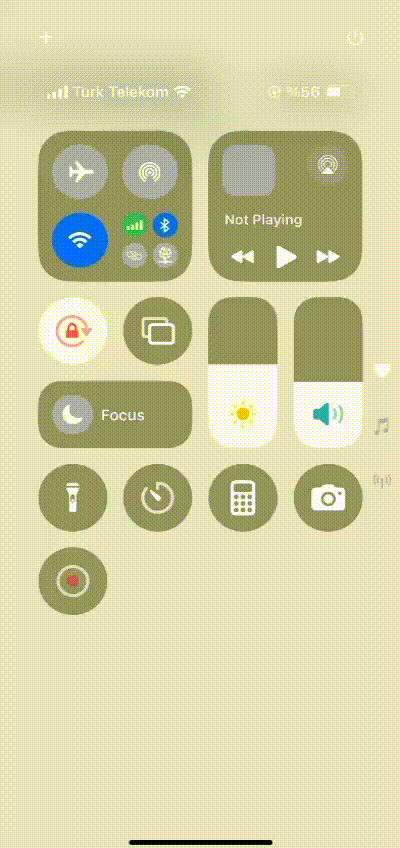
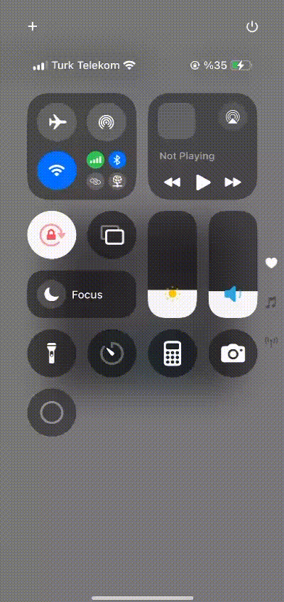

# react-native-simple-shake

## Overview

React Native Simple Shake is a lightweight and powerful package designed for detecting shake gestures on both iOS and Android platforms. Built to support the New Architecture, it offers seamless integration and performance optimization for modern React Native applications.

## Key Features:
New Architecture Compatible: Fully compatible with React Native's New Architecture for enhanced speed and stability.
Cross-Platform Support: Works effortlessly on both iOS and Android.
Event Listener: Easily set up listeners to detect shake gestures in real-time.
Customizable Sensitivity: Adjust shake detection sensitivity to suit your app's needs.
Minimal Dependencies: A clean and lightweight implementation to keep your app fast and responsive.
Whether you’re building an app that responds to gestures or implementing fun and interactive features, React Native Simple Shake simplifies the process while ensuring compatibility with the latest React Native advancements.

## Demo





## Installation

Install the library using npm or yarn:

```bash
npm install react-native-simple-shake
# or
yarn add react-native-simple-shake
```

---

## Usage Guide

### Example Code

Here’s a basic implementation of the `react-native-simple-shake` library:

```javascript
import React, { useEffect } from 'react';
import { SafeAreaView, StyleSheet, Text } from 'react-native';
import { shakeListener } from 'react-native-simple-shake';

const ShakeComponent = (): JSX.Element => {
  useEffect(() => {
    const subscription = shakeListener(() => {
      alert('Shake event detected');
    });

    return (): void => {
      subscription.remove();
    };
  }, []);
  return (
    <SafeAreaView style={styles.container}>
      <Text style={styles.text}>Shake the device to trigger an alert</Text>
    </SafeAreaView>
  );
};

const styles = StyleSheet.create({
  container: {
    padding: 20,
  },
  text: {
    fontSize: 20,
    marginBottom: 20,
  },
});

export default ShakeComponent;
```


## License
This package is distributed under the MIT License. See the LICENSE file for details.
---
## Contributing
We welcome contributions from the community! Submit issues or pull requests on the GitHub repository to help improve the package.

